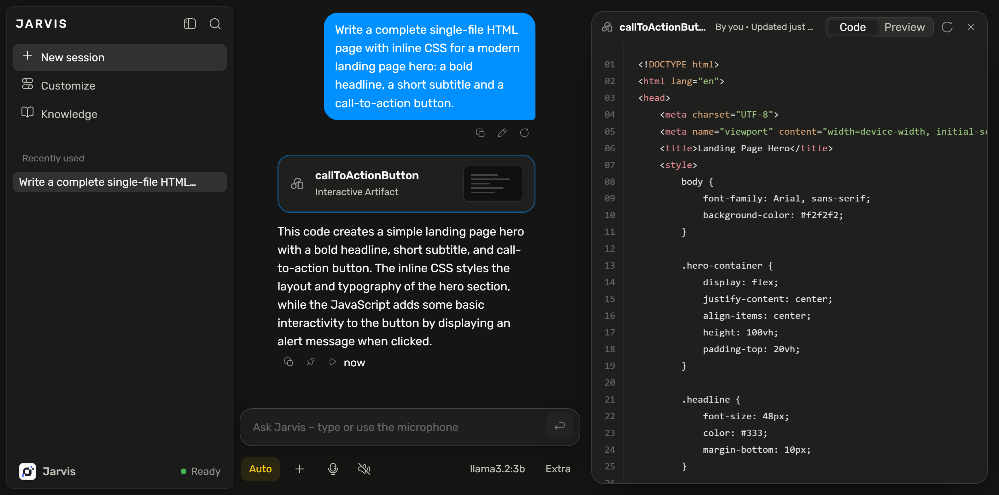

# 🤖 Jarvis

**Your own AI assistant — 100% local, private, and agentic. Runs in your browser, powered by Ollama.**

Jarvis is a fully local, privacy-first personal assistant that runs on your own PC. It pairs a polished, modern chat interface with a local LLM backend ([Ollama](https://ollama.com)) — nothing is ever sent to the cloud. But Jarvis is more than a chatbot: with its optional action server it becomes a real *work beast* that can see your screen, open apps, run commands, build entire websites, search the web, and complete multi-step tasks on your machine — always asking before it does anything risky.

<p align="center">
  
</p>

<p align="center">
  &nbsp;
  
</p>

<p align="center">
  
</p>

<p align="center">
  
</p>

---

## ✨ Features

**Chat & UI**
- Clean, fast, modern interface — dark theme, collapsible sidebar, streaming responses
- Rich Markdown: tables, task lists, and syntax-highlighted code
- **Effort slider** (Faster ↔ Smarter) that genuinely changes behavior — toggling the model's "thinking" and answer style
- Live **code streaming** into a side panel — watch files and websites render as they're written
- Chat history with search & sort ("Recently used"), persisted across restarts
- English by default, with a one-click **German** toggle
- Custom dropdowns throughout — no clunky native selects

**Models**
- Built-in **Models library** — browse and one-click-install a curated catalog of 236 Ollama models
- **Scan my PC** — reads your real hardware (CPU / RAM / GPU / VRAM) and recommends the best-fitting models, with an optional live tokens/sec benchmark
- Streams the full HuggingFace GGUF library on scroll

**Agentic "work beast" abilities** *(full mode)*
- 🖥️ **See your screen** — screenshot + a local vision model (e.g. `qwen2.5vl`) describes it or answers questions
- 🚀 Open apps & websites, type text, control media & volume, read system info
- 🛠️ Run shell commands and create files or entire websites (rendered live in the side code panel)
- 🌐 Local web search (DuckDuckGo) and page reading
- 🤝 Autonomously complete multi-step PC tasks
- 🔊 Optional offline speech-to-text (Whisper), hyper-real local voices (XTTS), and local image generation (Z-Image)
- ✅ **Confirm-before-risky** — delete, shutdown, send email, or run command always ask first

**Privacy**
- 100% local. Servers bind to `127.0.0.1` only. No telemetry, ever.

---

## 🚀 Quick start

The **only required install is Ollama**. Python is optional and only unlocks the agentic "full mode."

### Fastest — zero install

Everything you need for chatting, the model picker, history, and settings. No web server, no Python.

1. **Install Ollama** → [ollama.com](https://ollama.com) (one-click).
2. **Pull a model:**
   ```bash
   ollama pull llama3.2
   ```
3. **Open the app** — just double-click `frontend/index.html` (opens as `file://` in your browser), or run the launcher:
   ```bat
   Jarvis.bat
   ```

> **First-time `file://` setup:** opening `index.html` directly makes your browser send requests from a `file://` origin, which Ollama blocks by default. Allow it once, then restart Ollama:
> ```bash
> setx OLLAMA_ORIGINS "*"      # Windows
> export OLLAMA_ORIGINS="*"    # macOS/Linux — add to your shell rc
> ```
> The full-mode launchers serve the app from `localhost` (which Ollama already allows), so this step is only for the double-click path.

That's it. Chat, the Effort slider, Customize (profile) & Knowledge (documents), the Models library, and your saved chat history all work — and persist across restarts via your browser's local storage.

### Full experience — optional

Adds web search, PC control, screen vision, and optional voices/STT/image generation. Requires **Python 3** (most dev PCs already have it).

**Windows:**
```bat
Jarvis.bat
```
> `Jarvis.bat` auto-detects Python: if it's installed you get the full experience automatically; if not, it falls back to zero-install core mode.

**macOS / Linux (or Windows):**
```bash
python frontend/start.py
```

This starts the local helper servers and serves the app at **http://localhost:8000** (using `localhost` — not `file://` — so your browser remembers microphone permission).

---

## 🔌 What runs where / ports

| Service | Port | Needed for | Requires |
| --- | --- | --- | --- |
| **Ollama** | `11434` | Chat, all model inference | Ollama (required) |
| App server (`serve.py`) | `8000` | Serving the app so mic permission sticks | Python 3 (full mode) |
| Web search (`search-server.py`) | `7863` | Local DuckDuckGo search & page reading | Python 3 (stdlib) |
| Action server (`action-server.py`) | `7864` | PC & browser control, screen vision, files | Python 3 (+ optional pip extras) |
| Speech-to-text (`stt-server.py`) | `7865` | Offline voice input (Whisper) | Python 3 + `faster-whisper` |
| Text-to-speech (`tts-server.py`) | `7862` | Hyper-real local voices (XTTS) | Python 3 + XTTS venv |
| Image generation (`zimage-server.py`) | `7861` | Local image generation (Z-Image) | Python 3 + Z-Image venv |

All servers bind to `127.0.0.1` only. The action server is loopback-only by design.

---

## 🕹️ Using it

- **Pick a model** — use the model dropdown at the top of the chat. Only models you've pulled with Ollama appear.
- **Effort slider** — drag toward *Smarter* for deeper reasoning, or *Faster* for quick answers. It really does toggle the model's thinking and answer style.
- **Customize & Knowledge** — set your profile in *Customize* and drop reference documents into *Knowledge*. Both persist across restarts.
- **Models page** — click **Models** to browse and one-click-install from the bundled catalog. Hit **Scan my PC** to get hardware-matched recommendations (and an optional tokens/sec benchmark).
- **Chat history** — past conversations live under "Recently used" in the sidebar, with search & sort.
- **German** — toggle the language in settings; English is the default.

---

## ⚙️ Configuration

Configuration is **optional** — Jarvis runs fine with defaults. To enable email sending (SMTP) or tighten app/domain whitelists:

```bash
# from the project root
cp frontend/config.example.json frontend/config.json
```

Then edit `frontend/config.json`. It's read by the action server at startup and covers `app_whitelist` (apps the assistant may open), `allowed_domains` (restrict server-side page reading/automation — empty means no restriction), `smtp` (mail credentials), and which action types must be confirmed.

> `config.json` is **gitignored** — keep your secrets out of version control. `config.example.json` is the safe template.

---

## 🔒 Privacy & safety

- **100% local.** All inference runs through Ollama on your machine. No cloud calls, no telemetry.
- **Loopback only.** Every helper server binds to `127.0.0.1`, so only local processes can reach them.
- **Confirm before risky actions.** Deleting files, powering off, sending email, or running commands always prompt for a quick confirmation first.
- **Sandboxed file work.** File operations default to a workspace folder; sensitive paths require confirmation.

---

## 📦 Requirements

- **Ollama** — *required*. [ollama.com](https://ollama.com), plus at least one pulled model (e.g. `ollama pull llama3.2`).
- **A modern browser** — Chrome, Edge, Firefox, or Safari.
- **Python 3** — *optional*, only for full mode (web search, PC control, vision, voices). The core helpers use the standard library only.
- **Optional pip extras** for extended abilities (`frontend/requirements.txt`):
  ```bash
  pip install -r frontend/requirements.txt
  ```
  - `psutil` — system info · `pillow` / `mss` — screenshots & vision · `pyautogui` — mouse/keyboard & autonomous agent · `pyperclip`, `pygetwindow` — clipboard & window management
  - `faster-whisper` — offline speech-to-text
  - XTTS (voices) and Z-Image (image gen) run in their own venvs (`tools/tts-venv`, `tools/zimage-venv`)

Every optional feature degrades gracefully if its package is missing.

---

## 🩺 Troubleshooting

- **Stuck on "Connecting…" / no response** — Ollama isn't running. Start it (launch the Ollama app, or run `ollama serve`) and reload.
- **"Failed to fetch" / nothing happens when you open `index.html` directly** — a `file://` page is blocked by Ollama's CORS policy. Set `OLLAMA_ORIGINS="*"` once (see the first-time note in Quick start) and restart Ollama, or use full mode (`Jarvis.bat` / `python frontend/start.py`), which serves from `localhost`.
- **No models in the dropdown** — you haven't pulled one yet. Run `ollama pull llama3.2` (or install one from the Models page), then refresh.
- **Microphone doesn't work** — the mic needs a real origin, not `file://`. Use full mode (`Jarvis.bat` / `python frontend/start.py`) so the app is served at `http://localhost:8000`, then allow mic access.
- **Two tabs open** — that's fine; Jarvis handles multiple tabs and shares the same local storage.
- **A feature is missing in full mode** — it likely needs an optional package. Check the server's `GET /capabilities` and install the relevant extra from `frontend/requirements.txt`.

---

## 📄 License

MIT © 2026 [Oddware](https://github.com/Oddware26) — see [`LICENSE`](LICENSE).

Built on local, open-source models via [Ollama](https://ollama.com), with Whisper, XTTS, and Z-Image powering optional speech and image features. Bundles the [Rubik](https://github.com/googlefonts/rubik) and [OpenDyslexic](https://opendyslexic.org) fonts (SIL Open Font License) and [Hugeicons Free](https://hugeicons.com) icons (MIT) — full attributions in [`THIRD-PARTY-NOTICES.md`](THIRD-PARTY-NOTICES.md). Your data stays on your machine.
