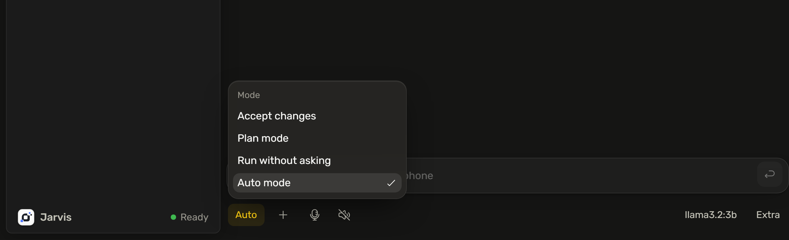
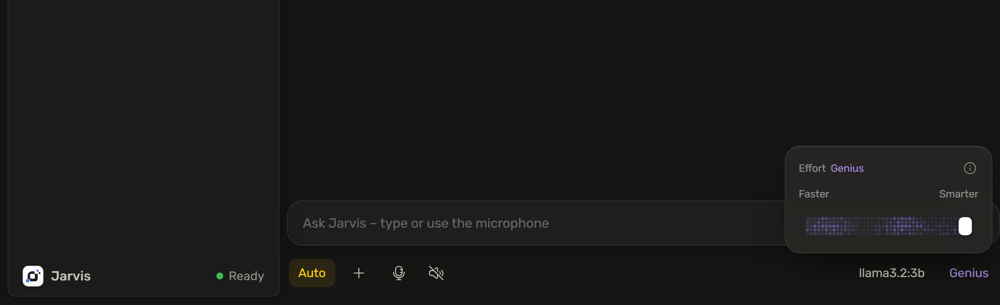

# 🤖 Jarvis

**Your own AI assistant — 100% local, private, and agentic. Runs in your browser, powered by Ollama.**

Jarvis is a fully local, privacy-first personal assistant that runs on your own PC. It pairs a polished, modern chat interface with a local LLM backend ([Ollama](https://ollama.com)) — nothing is ever sent to the cloud. But Jarvis is more than a chatbot: its action server makes it a real *work beast* that can see your screen, open apps, run commands, build entire websites, search the web, and complete multi-step tasks on your machine — always asking before it does anything risky.

<p align="center">
  
</p>

<p align="center">
  &nbsp;
  
</p>

<p align="center">
  
</p>

<p align="center">
  
</p>

---

## ✨ Features

**Chat & UI**
- Clean, fast, modern interface — dark theme, collapsible sidebar, streaming responses
- Rich Markdown: tables, task lists, and syntax-highlighted code
- **Effort slider** (Faster ↔ Smarter) that genuinely changes behavior — toggling the model's "thinking" and answer style
- Live **code streaming** into a side panel — watch files and websites render as they're written
- Chat history with search & sort ("Recently used"), persisted across restarts
- English by default, with a one-click **German** toggle
- Custom dropdowns throughout — no clunky native selects

**Models**
- Built-in **Models library** — browse and one-click-install a curated catalog of 236 Ollama models
- **Scan my PC** — reads your real hardware (CPU / RAM / GPU / VRAM) and recommends the best-fitting models, with an optional live tokens/sec benchmark
- Streams the full HuggingFace GGUF library on scroll

**Agentic "work beast" abilities**
- 🖥️ **See your screen** — screenshot + a local vision model (e.g. `qwen2.5vl`) describes it or answers questions
- 🚀 Open apps & websites, type text, control media & volume, read system info
- 🛠️ Run shell commands and create files or entire websites (rendered live in the side code panel)
- 🌐 Local web search (DuckDuckGo) and page reading
- 🤝 Autonomously complete multi-step PC tasks
- 🔊 Offline speech-to-text (Whisper), hyper-real local voices (XTTS), and local image generation (Z-Image)
- ✅ **Confirm-before-risky** — delete, shutdown, send email, or run command always ask first

<p align="center">
  &nbsp;
  
</p>

<p align="center">
  
</p>

<p align="center">
  
</p>

**Privacy**
- 100% local. Servers bind to `127.0.0.1` only. No telemetry, ever.

---

## 🚀 Installation — everything, in three steps

This guide installs **all** of Jarvis: chat, web search, PC control, screen vision, offline voice input (Whisper), hyper-real voices (XTTS), and local image generation (Z-Image). Plan for roughly **45–50 GB** of downloads and an **NVIDIA GPU** for the heavy parts.

### Windows

1. **Install the two base tools** (each is a one-click installer):
   - [Ollama](https://ollama.com) — runs the AI models
   - [Python 3.10+](https://python.org) — **tick "Add python.exe to PATH"** during install
2. **Run the setup** (double-click, or from a terminal):
   ```bat
   setup.bat
   ```
   It installs everything in one go and is safe to re-run — finished steps are skipped:
   - Ollama models: `llama3.1:8b` (chat + tools), `qwen2.5vl:7b` (screen vision), `nomic-embed-text` (Knowledge/RAG)
   - Python packages for PC control, screenshots, clipboard, autonomous agent, and Whisper voice input
   - The XTTS-v2 voice environment (`tools/tts-venv`, ~2 GB — the 1.8 GB voice model downloads on first use)
   - The Z-Image environment (`tools/zimage-venv`) plus the ~31 GB Z-Image-Turbo weights into `~/Z-Image-Turbo`
3. **Start Jarvis:**
   ```bat
   Jarvis.bat
   ```
   All services launch automatically and the app opens at **http://localhost:8000**.

### macOS / Linux

Same idea, by hand:

```bash
# 1) Base tools: install Ollama (ollama.com) and Python 3.10+, then:
ollama pull llama3.1:8b && ollama pull qwen2.5vl:7b && ollama pull nomic-embed-text
pip install -r frontend/requirements.txt

# 2) XTTS voices (own venv)
python3 -m venv frontend/tools/tts-venv
frontend/tools/tts-venv/bin/pip install torch torchaudio coqui-tts

# 3) Z-Image image generation (own venv + ~31 GB weights)
python3 -m venv frontend/tools/zimage-venv
frontend/tools/zimage-venv/bin/pip install torch torchvision diffusers transformers \
    accelerate safetensors sentencepiece pillow "huggingface_hub[cli]"
frontend/tools/zimage-venv/bin/hf download Tongyi-MAI/Z-Image-Turbo --local-dir ~/Z-Image-Turbo

# 4) Start everything
python3 frontend/start.py
```

> **Tip:** if `from diffusers import ZImagePipeline` fails, your diffusers release predates Z-Image support — install it from GitHub: `pip install "git+https://github.com/huggingface/diffusers"`.

---

## 🔌 What runs where / ports

All of this is installed by `setup.bat` and started by `Jarvis.bat` / `start.py`:

| Service | Port | Needed for |
| --- | --- | --- |
| **Ollama** | `11434` | Chat, all model inference |
| App server (`serve.py`) | `8000` | Serving the app so mic permission sticks |
| Web search (`search-server.py`) | `7863` | Local DuckDuckGo search & page reading |
| Action server (`action-server.py`) | `7864` | PC & browser control, screen vision, files |
| Speech-to-text (`stt-server.py`) | `7865` | Offline voice input (Whisper) |
| Text-to-speech (`tts-server.py`) | `7862` | Hyper-real local voices (XTTS) |
| Image generation (`zimage-server.py`) | `7861` | Local image generation (Z-Image) |

All servers bind to `127.0.0.1` only. The action server is loopback-only by design.

---

## 🕹️ Using it

- **Pick a model** — use the model dropdown at the top of the chat. Only models you've pulled with Ollama appear.
- **Effort slider** — drag toward *Smarter* for deeper reasoning, or *Faster* for quick answers. It really does toggle the model's thinking and answer style.
- **Customize & Knowledge** — set your profile in *Customize* and drop reference documents into *Knowledge*. Both persist across restarts.
- **Models page** — click **Models** to browse and one-click-install from the bundled catalog. Hit **Scan my PC** to get hardware-matched recommendations (and an optional tokens/sec benchmark).
- **Chat history** — past conversations live under "Recently used" in the sidebar, with search & sort.
- **German** — toggle the language in settings; English is the default.

---

## ⚙️ Configuration

Configuration is **optional** — Jarvis runs fine with defaults. To enable email sending (SMTP) or tighten app/domain whitelists:

```bash
# from the project root
cp frontend/config.example.json frontend/config.json
```

Then edit `frontend/config.json`. It's read by the action server at startup and covers `app_whitelist` (apps the assistant may open), `allowed_domains` (restrict server-side page reading/automation — empty means no restriction), `smtp` (mail credentials), and which action types must be confirmed.

> `config.json` is **gitignored** — keep your secrets out of version control. `config.example.json` is the safe template.

---

## 🔒 Privacy & safety

- **100% local.** All inference runs through Ollama on your machine. No cloud calls, no telemetry.
- **Loopback only.** Every helper server binds to `127.0.0.1`, so only local processes can reach them.
- **Confirm before risky actions.** Deleting files, powering off, sending email, or running commands always prompt for a quick confirmation first.
- **Sandboxed file work.** File operations default to a workspace folder; sensitive paths require confirmation.

---

## 📦 Requirements

- **Ollama** — [ollama.com](https://ollama.com). Runs every model locally.
- **Python 3.10+** — powers the helper servers (web search, PC control, vision, voices, images).
- **A modern browser** — Chrome, Edge, Firefox, or Safari.
- **Hardware** — an NVIDIA GPU (8 GB+ VRAM) is strongly recommended for vision, voices, and image generation; ~50 GB free disk for models and weights.

Everything else (`pip` packages, the XTTS and Z-Image environments, model weights) is installed by `setup.bat` — see the installation guide above. If a package is missing anyway, the affected feature degrades gracefully instead of breaking the app.

---

## 🩺 Troubleshooting

- **Stuck on "Connecting…" / no response** — Ollama isn't running. Start it (launch the Ollama app, or run `ollama serve`) and reload.
- **"Failed to fetch" / nothing happens when you open `index.html` directly** — a `file://` page is blocked by Ollama's CORS policy. Always start via `Jarvis.bat` / `python frontend/start.py` (serves from `localhost`), or allow it once with `setx OLLAMA_ORIGINS "*"` and restart Ollama.
- **No models in the dropdown** — `setup.bat` hasn't pulled them yet. Run it, or `ollama pull llama3.1:8b`, then refresh.
- **Microphone doesn't work** — the mic needs a real origin, not `file://`. Start via `Jarvis.bat` / `python frontend/start.py` so the app is served at `http://localhost:8000`, then allow mic access.
- **Two tabs open** — that's fine; Jarvis handles multiple tabs and shares the same local storage.
- **A feature is missing** — its install step probably failed. Re-run `setup.bat` (finished steps are skipped) and check the action server's `GET /capabilities`.
- **Screen vision answers oddly / errors** — pull the vision model (`ollama pull qwen2.5vl:7b`) or set a bigger one in `frontend/config.json` (`"vision_model": "qwen2.5vl:32b"`).

---

## 📄 License

MIT © 2026 [Oddware](https://github.com/Oddware26) — see [`LICENSE`](LICENSE).

Built on local, open-source models via [Ollama](https://ollama.com), with Whisper, XTTS, and Z-Image powering the speech and image features. Bundles the [Rubik](https://github.com/googlefonts/rubik) and [OpenDyslexic](https://opendyslexic.org) fonts (SIL Open Font License) and [Hugeicons Free](https://hugeicons.com) icons (MIT) — full attributions in [`THIRD-PARTY-NOTICES.md`](THIRD-PARTY-NOTICES.md). Your data stays on your machine.
